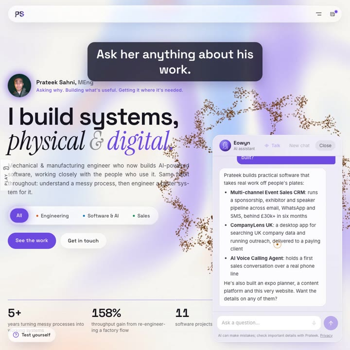

# Prateek Sahni — Portfolio Website

The source behind **[prateeksahni.pages.dev](https://prateeksahni.pages.dev)**: a project-first portfolio across engineering, software & AI, and sales, with an AI assistant that answers visitors' questions from the site's own content, by text or voice.

**▶ [Watch the one-minute intro video](media/intro.mp4)**

## What it does

- Interactive three.js hero with objects drawn as neural networks, recoloured for each area of work
- Area switcher (Engineering · Software & AI · Sales) that changes the projects, stats and accent colours
- 28 project case studies with problem, approach, outcome and skills, filterable by skill; projects with screenshot galleries listed first
- Skills section built automatically from the projects: every skill carries its logo or icon, each area's most-used skills sit up front as tiles, and hovering or tapping a skill lists the projects that used it, one click from the full case study
- **Eowyn**, an AI assistant on a serverless function that streams answers from the site's own content, protected by a Cloudflare Turnstile human check (invisible for most visitors, a one-click box only when Cloudflare is unsure) that issues a signed six-hour pass, plus origin checks and daily usage limits stored against hashed IPs
- A five-model fallback chain across two providers (NVIDIA Nemotron, then Meta Llama, Alibaba Qwen, Mistral and Google Gemma on Cloudflare Workers AI), so a model retirement or outage never takes the assistant down
- Hands-free voice conversation with Eowyn, using the browser's own speech recognition and speech, so voice costs nothing to run: she listens, answers aloud sentence by sentence as the reply arrives in the most natural female voice the device has (Irish where available, at a calm, unhurried pace), then listens again; plus speech-to-text typing
- Listening tuned per platform: Android, which can't listen continuously, gets one session per question instead of a restart loop
- An animated avatar for Eowyn: a profile drawn as a network of shimmering points, with hair that flows in a breeze
- Ten short browser games, each built around a real idea from the three areas (control charts, bottlenecks, tolerances, prompt hallucinations, sales discovery and more)
- A timed quiz per area, drawn from a pool of about 125 questions, with streaks, levels and a review of missed answers
- Industry news panel with trending and upcoming headlines per area, pulled from trade-publication RSS feeds and cached at the edge
- Hidden extras: easter eggs in the hero and a playable 404 page
- A giant walking figure made of glowing points that strides across the screen now and then, holds the visitor's gaze, then flies Superman-style into one of the site's features; it only starts at calm moments and never blocks a click
- Compact navigation that tucks the sections behind a morphing menu icon, marks the section you're in, and gives first-time visitors a one-off hint
- Pages prerendered to static HTML for speed and search, then hydrated in the browser
- Strict security headers (CSP with hashed inline scripts, HSTS), no cookies or local storage, plain-English privacy notice and terms
- Lighthouse: 100 for SEO, accessibility and best practices

## Stack

React 19 · Vite · Tailwind CSS v4 · three.js / React Three Fiber · Motion · GSAP · Cloudflare Pages, Functions, KV & Workers AI · NVIDIA API · Web Speech API · Web3Forms

---

This is a private project. This repository is a public overview only; no source code is published here.
